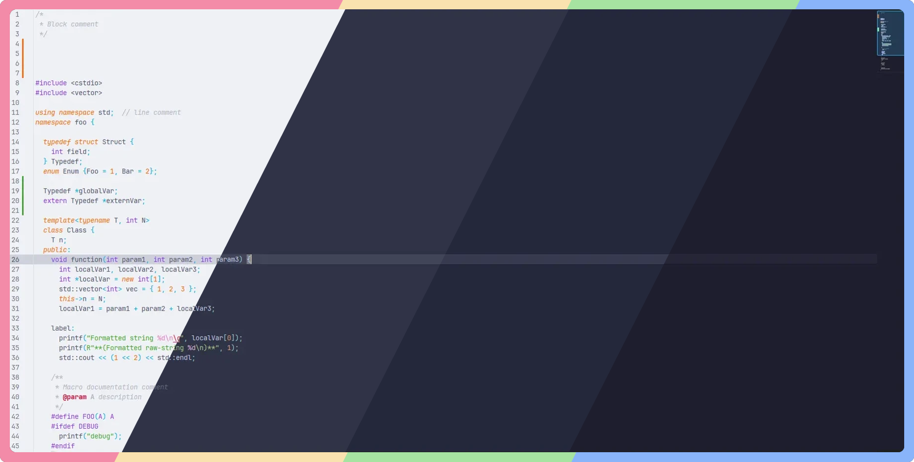
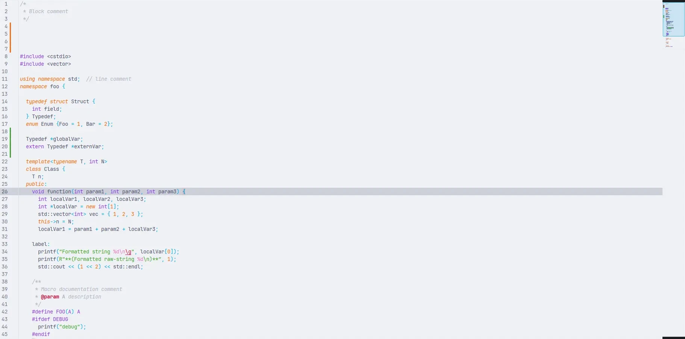
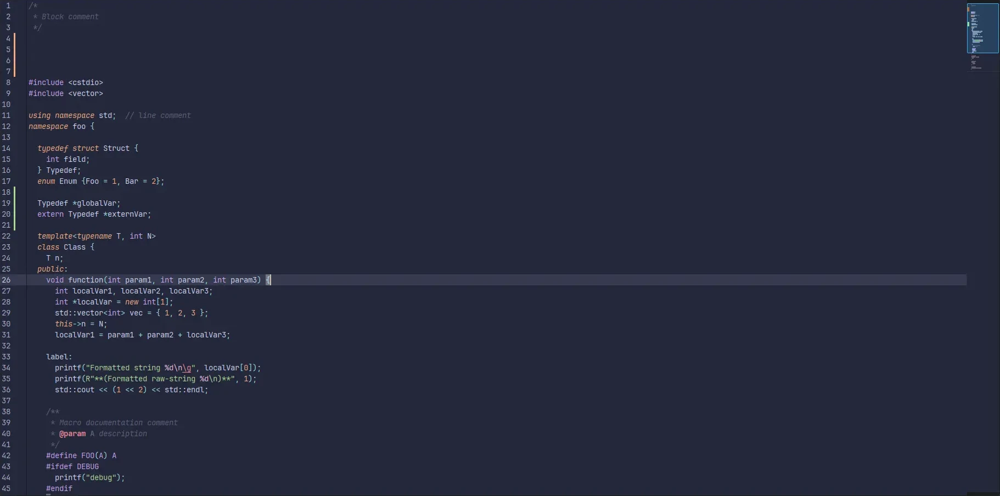
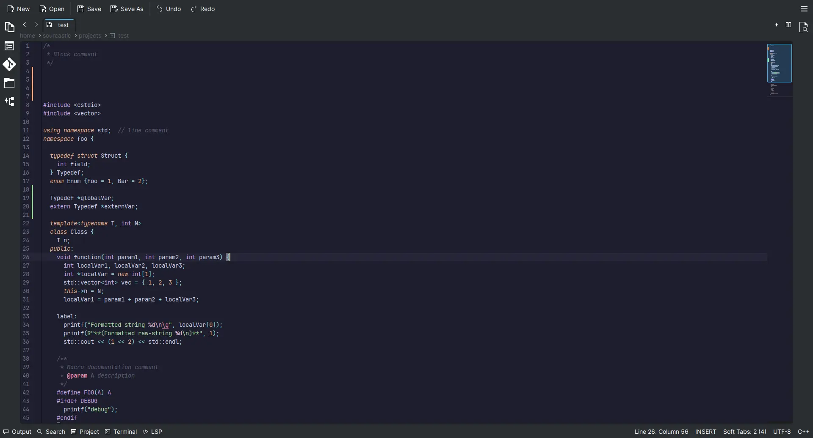

<h3 align="center">
	 
	
	Catppuccin for <a href="https://invent.kde.org/frameworks/syntax-highlighting#introduction">KSyntaxHighlighting</a>
	
</h3>

	
	
	

	

## Previews

🌻 Latte

🪴 Frappé

🌺 Macchiato

🌿 Mocha

## Usage

> [!NOTE]
> KSyntaxHighlighting is a syntax highlighting library provided by KDE Frameworks that is used within KDE Applications such as Kate, Kwrite, Kile, etc. It can also be freely used by third party appplications. As such, this theme only covers syntax highlighting and not the application theme.

> [!TIP]
> As of KDE Frameworks 5.106, the Catppuccin KSyntax themes are included by default. In order to use it, simply select it from the app's settings.

1. Download your preferred flavor(s) from [`themes/`](./themes/).
2. Open the text editor.
3. Go to **Settings** > **Configure editor** > **Color Themes** > **Theme Editor**.
4. Select **Import** and upload your chosen flavor(s) from Step 1.
5. Go to the **Default Theme** tab and set your flavor as default.

## 🙋 FAQ

- Q: **_"Where do I find documentation for KSyntaxHighlighting?"_**\
  A: See https://docs.kde.org/stable5/en/kate/katepart/color-themes.html.

## 💝 Thanks to

- [Sourcastic](https://github.com/Sourcastic)

&nbsp;

	

	Copyright &copy; 2021-present <a href="https://github.com/catppuccin" target="_blank">Catppuccin Org</a>

	

